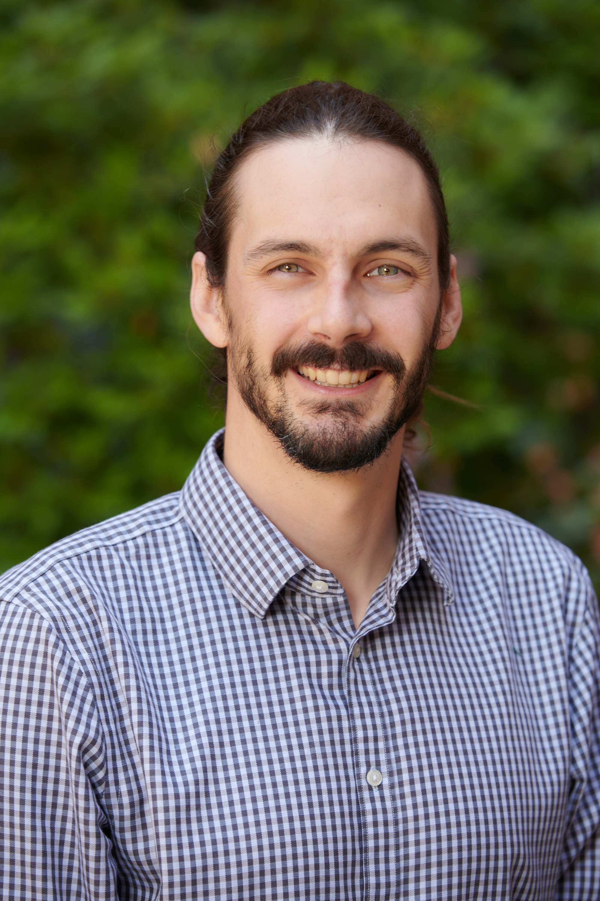

# About Me

Welcome to my research page! I'm a PhD student in Biostatistics at the [University of Washington](http://biostat.washington.edu/).

Before joining UW Biostatistics, I studied Organismic and Evolutionary Biology at [Harvard University](http://oeb.harvard.edu/), with a language citation in Spanish. I was a research associate at the [Institute for Genomic Medicine](http://igm.columbia.edu) at Columbia University.

I currently work with Dr. Lurdes Inoue, exploring the connections between Bayesian and frequentist approaches to dynamic treatment regimes. My collaborative projects include work with Dr. Bruce Weir and Dr. Sam Wasser, adapting forensic genetic techniques to combat elephant poaching.

## Research interests
I am broadly interested in statistics and biostatistics with a current focus on:
* Decision theory
* Missing data
* Statistical genetics
* Bayesian methods
* Applications to public health, medicine, and biology

<!---
## Papers

### Theory & Methodology

1. [Variance-adaptive confidence sequences by betting](https://arxiv.org/pdf/2010.09686.pdf)\\
	I. Waudby-Smith and A. Ramdas

2. [Confidence sequences for sampling without replacement](https://arxiv.org/pdf/2006.04347.pdf)\\
	I. Waudby-Smith and A. Ramdas\\
	NeurIPS (2020)

### Applications

1. [Using Both Time Tradeoff and Discrete Choice Experiments in Valuing the EQ-5D: Impact of Model Misspecification on Value Sets](https://journals.sagepub.com/doi/full/10.1177/0272989X20924019?casa_token=t1lzCUY2vb0AAAAA%3AxQMLwfFJC5bp7jxtUbYSHpHXeIY9fzZR1vlmq7Xqx7iWKLsK5OFSJYVJHotwrxuxVCo19QCI_S1VTw)\\
	I. Waudby-Smith, A. S. Pickard, F. Xie, E. M. Pullenayegum\\
	Medical Decision Making (2020)

2. [Sentiment in nursing notes as an indicator of out-of-hospital mortality in intensive care patients](https://journals.plos.org/plosone/article?id=10.1371/journal.pone.0198687)\\
	I. Waudby-Smith, N. Tran, J. A. Dubin, J. Lee\\
	PLoS one (2018)
-->
