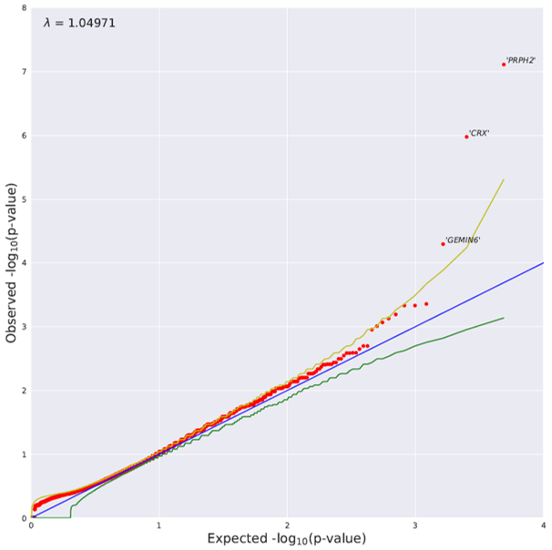

## Dynamic treatment regimes

## Forensic genetics

## Genomic medicine

I'm interested in developing improved methods for rare variant association studies. Genetic association analyses with rare variants tend to suffer from low power and inflated type I error. I aim to leverage biologically relevant genomic information in order to efficiently pinpoint genetic signal. 

1. Raghavan NS, Brickman AM, Andrew H, Manly JJ, Schupf N, Lantigua R, The Alzheimer's Disease Sequencing Project, **Wolock CJ**, Kamalakaran S, Petrovski S, Tosto G, Vardarajan BN, Goldstein DB, Mayeux R. Whole exome sequencing in 20,197 individuals identifies ultra-rare SORL1 loss-of-function variants in late-onset Alzheimer’s disease. *Annals of Clinical and Translational Neurology* (2018).

2. Hayeck TJ, Stong N, **Wolock CJ**, Copeland B, Kamalakaran S, Goldstein DB, Allen AS. Improved Pathogenic Variant Localization using a Hierarchical Model of Sub-regional Intolerance. *American Journal of Human Genetics* (2019)

3. **Wolock CJ**, Stong N, Ma F, Nagasaki T, Lee W, Tsang SH, Kamalakaran S, Goldstein DB, Allikmets R. A case-control collapsing analysis identifies retinal dystrophy genes associated with ophthalmic disease in patients with no pathogenic *ABCA4* mutations. *Genetics in Medicine* (2019). 

 4. Gelfman S, Dugger SA, Moreno CAM, Ren Z, **Wolock CJ**, Shneider NA, Phatnani H, Cirulli ET, Lasseigne BN, Harris T, Maniatis T, Rouleau GA, Brown RH, Gitler AD, Myers RM, Petrovski S, Allen AS, Harms MB, Goldstein DB. A new approach for rare variation collapsing on functional protein domains implicates specific genic regions in ALS. *Genome Research* (2019). 
   
 5. Cameron-Christie S, **Wolock CJ**, Groopman E, Petrovski S, Kamalakaran S, Povysil G, Zhang M, Fleckner J, March RE, Gelfman S, Marasa M, Li Y, Sanna-Cherchi S, Kiryluk K, Allen AS, Fellström B, Haefliger C, Platt A, Goldstein DB, Gharavi A. Exome-based rare-variant analyses in chronic kidney disease. *Journal of the American Society of Nephrology* (2019).

6. Ma CJ, **Wolock CJ**, Stong N, Nagasaki T, Lee W, Goldstein DB, Allikmets R. Case-control collapsing analysis identifies genes mimicking Stargardt/ABCA4 disease. *Investigative Ophthalmology & Visual Science* (2019).

## Miscellaneous

As an undergraduate, I was involved in several projects, including work on carnivorous pitcher plant microbiomes and iron redox during the late Proterozoic era. 

1. Sperling EA, **Wolock CJ**, Morgan AS, Gill BC, Kunzmann M, Halverson GP, Macdonald FA, Knoll AH, Johnston DT.  Statistical analysis of iron geochemical data suggests limited late Proterozoic oxygenation. *Nature* (2015).

2. Bittleston LS, **Wolock CJ**, Bakhtiar EY, Chan XY, Chan KG, Pierce NE, Pringle A. Convergence between the microcosms of Southeast Asian and North American pitcher plants. *eLife* (2018). 

<!---
## Papers

### Theory & Methodology

1. [Variance-adaptive confidence sequences by betting](https://arxiv.org/pdf/2010.09686.pdf)\\
	I. Waudby-Smith and A. Ramdas

2. [Confidence sequences for sampling without replacement](https://arxiv.org/pdf/2006.04347.pdf)\\
	I. Waudby-Smith and A. Ramdas\\
	NeurIPS (2020)

### Applications

1. [Using Both Time Tradeoff and Discrete Choice Experiments in Valuing the EQ-5D: Impact of Model Misspecification on Value Sets](https://journals.sagepub.com/doi/full/10.1177/0272989X20924019?casa_token=t1lzCUY2vb0AAAAA%3AxQMLwfFJC5bp7jxtUbYSHpHXeIY9fzZR1vlmq7Xqx7iWKLsK5OFSJYVJHotwrxuxVCo19QCI_S1VTw)\\
	I. Waudby-Smith, A. S. Pickard, F. Xie, E. M. Pullenayegum\\
	Medical Decision Making (2020)

2. [Sentiment in nursing notes as an indicator of out-of-hospital mortality in intensive care patients](https://journals.plos.org/plosone/article?id=10.1371/journal.pone.0198687)\\
	I. Waudby-Smith, N. Tran, J. A. Dubin, J. Lee\\
	PLoS one (2018)
-->
